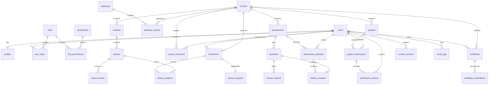

# Phase 2 repository audit and implementation plan

Audit date: 2026-08-15

## 1. Repository audit

### Current architecture

The repository is a client-rendered React 19 single-page application built with Vite 7, TanStack Router, TypeScript, and Tailwind CSS 4. It is deployed as static assets with a Vercel rewrite to `index.html`.

The approved frontend contains these public routes:

| Route | Current data source | Authentication needed in Phase 2 |
| --- | --- | --- |
| `/` | Static arrays | No |
| `/explore` | Static course arrays | No |
| `/pathways` | Static pathway arrays | No |
| `/courses` | Static course arrays | No, published records only |
| `/courses/$courseSlug` | Static course arrays | No, published records only |
| `/courses/$courseSlug/lessons/$lessonSlug` | Static arrays and localStorage | Yes for progress and enrolled content |
| `/labs` | Static lab arrays | No for catalogue |
| `/resources` | Component-local static data | No for public resources |
| `/my-learning` | Hardcoded learner state | Yes |

No server runtime, API implementation, database, authentication, environment example, migration tooling, test runner, or ESLint configuration exists at the start of Phase 2.

### Baseline checks

| Check | Result before Phase 2 |
| --- | --- |
| TypeScript and production build | Pass |
| ESLint | Fail because `eslint.config.js` is missing |
| Automated tests | Fail because no test script or tests exist |
| Application start | Pass on Vite development server |
| Main route HTTP checks | Pass |

### Mock and browser-local state

- `src/data/academy.ts` is the source of all pathways, courses, module titles, lesson titles, levels, duration, outcomes, and labs.
- `src/routes/courses/$courseSlug/lessons/$lessonSlug.tsx` writes keys such as `done:<courseSlug>:<lessonSlug>` directly to localStorage.
- `src/routes/my-learning.tsx` contains hardcoded streak, time, lesson count, percentage, and certificate count.
- Lesson instructional content and the knowledge check are one shared representative template, not unique authored lesson records.
- Resource records are declared inside `src/routes/resources.tsx`.
- Homepage counts are hardcoded.
- No silent network or server fallback currently exists.

### Documentation inconsistencies

- Earlier product notes mention TanStack Start, but the repository uses TanStack Router with a static Vite deployment. Phase 2 will preserve the frontend framework and add same-origin Vercel serverless API functions rather than rebuild approved pages.
- The roadmap originally places administration and assessments in later numbered phases, while the supplied Phase 2 specification includes both. The supplied Phase 2 specification is authoritative for this implementation.
- The README says the experience is accessible, but no automated accessibility suite exists yet.
- The package contains a lint script but no configuration.

## 2. Mock-data migration map

| Prototype structure | Database destination | Migration treatment |
| --- | --- | --- |
| `pathways[]` | `pathways` | Seed stable slugs and editorial metadata |
| `pathway.courses` count | `pathway_courses` | Replace count with relationship query |
| `courses[]` metadata | `courses` | Seed records with draft editorial status |
| `course.modules[]` | `modules` | Seed ordered module rows |
| `module.lessons[]` strings | `lessons` | Seed ordered lesson shells |
| Shared lesson body | `lesson_blocks` | Replace with uniquely authored blocks |
| `course.outcomes[]` | `courses.learning_outcomes` initially, normalise later if reporting requires it | Store as validated text array |
| Lesson radio question | `assessments`, `questions`, `answer_options` | Seed versioned knowledge checks without client answers |
| localStorage completion keys | `lesson_progress` and import audit metadata | Offer explicit one-time merge after sign-in |
| Dashboard constants | enrolment and progress aggregate queries | Remove after server dashboard is connected |
| `labs[]` | Deferred lab model | Keep public catalogue static until a later approved lab migration |
| Resource component array | Deferred resource model | Keep public display static until file-backed resources are approved |

Seeded educational content is marked `draft` and `requires_editorial_approval = true`. It cannot appear in published database queries until Roy approves it.

## 3. Entity relationship diagram

Authentication also requires provider accounts, sessions, and verification tokens. These support tables are kept alongside the required domain entities.

## 4. Authentication decision

Use Better Auth with its Drizzle adapter and email/password provider.

Reasons:

- It supports secure database-backed sessions and revocation.
- Password hashing and reset token handling remain inside a maintained authentication library.
- It works with Drizzle and PostgreSQL.
- It can run in same-origin Vercel serverless functions without moving or redesigning the React frontend.
- It exposes a React client while retaining all identity and role authority on the server.
- Email verification and password reset callbacks can be connected to Resend.

Browser roles are display hints only. Server handlers retrieve the session, load database permissions, check suspension, and authorise each protected action.

## 5. Role and permission matrix

| Capability | Visitor | Learner | Instructor | Editor | Administrator | Super administrator |
| --- | :---: | :---: | :---: | :---: | :---: | :---: |
| Browse published courses | Yes | Yes | Yes | Yes | Yes | Yes |
| Enrol and save own progress | No | Yes | Yes | Yes | Yes | Yes |
| Submit own assessments and projects | No | Yes | Yes | Yes | Yes | Yes |
| Review assigned submissions | No | No | Yes | No | Yes | Yes |
| Create and edit content | No | No | Assigned only | Yes | Yes | Yes |
| Submit content for review | No | No | Assigned only | Yes | Yes | Yes |
| Approve and publish content | No | No | No | No | Yes | Yes |
| Manage learners and instructors | No | No | No | No | Yes | Yes |
| Issue and revoke certificates | No | No | No | No | Yes | Yes |
| Manage roles and permissions | No | No | No | No | No | Yes |
| View complete audit log | No | No | No | No | No | Yes |

An administrator cannot assign or remove the super administrator role. That operation requires an existing super administrator and an audit record.

## 6. Migration sequence

1. PostgreSQL extensions and enumerations
2. Users, profiles, authentication accounts, sessions, and verification tokens
3. Roles, permissions, role relationships, and initial least-privilege seeds
4. Pathways, courses, pathway relationships, and instructors
5. Modules, lessons, blocks, content versions, and editorial metadata
6. Enrolments, lesson progress, and course progress
7. Assessments, questions, options, attempts, and answers
8. Projects, submissions, and reviews
9. Certificates and verification events
10. Audit logs and supporting indexes
11. Draft course seed data in a separate, reviewable seed command

Migrations are append-only after preview or production use. Corrections are made with a new migration, not by editing an applied file.

## 7. File-storage decision

Use Vercel Blob for the Phase 2 foundation because deployment already targets Vercel and controlled uploads can use the same-origin server API. Private submission metadata and ownership remain in PostgreSQL. Production uploads use private storage and server-authorised downloads.

Allowed initial submission types:

- PDF
- Plain text
- DOCX
- PNG, JPEG, and WebP

Executable and active web content types are rejected. Limits are configured by purpose, with a conservative default of 10 MB. Safe storage names use generated identifiers rather than user filenames.

## 8. Risk register

| Risk | Impact | Mitigation |
| --- | --- | --- |
| Static frontend has no server runtime | High | Add isolated same-origin Vercel API functions and local Vite proxy support |
| No Neon credentials in repository environment | High | Build and test schema without secrets, then run integration migrations only in configured environments |
| Email verification cannot be end-to-end tested without a provider | High | Use an explicit local email capture mode and block production sending without configuration |
| Large Phase 2 scope could create an unreviewable release | High | Commit and review eight milestones independently |
| Seed lesson text could be mistaken for approved content | High | Seed as draft with editorial approval required and exclude from public published queries |
| Role escalation | Critical | Server permissions, protected super-admin operations, transaction and audit record |
| Client score or progress tampering | High | Server calculates grading and completion from authoritative rows |
| Preview deployment touches production | Critical | Environment guard checks database identity and requires explicit production confirmation |
| Serverless database connection pressure | Medium | Use Neon serverless driver and pooled connection URL |
| Private project files leak | High | Private Blob access, ownership table, authorised download endpoint |
| Local progress attaches to wrong account | Medium | Preview and explicit learner confirmation, idempotency key, no automatic import |
| Accessibility regressions in new forms | Medium | Keyboard tests, labels, focus management, status announcements, axe checks |

## 9. Implementation milestones

1. Database, migrations, authentication, profiles, roles, and permissions
2. Database-backed courses, modules, lessons, enrolment, and progress
3. Learner dashboard and confirmed local-progress import
4. Course administration, editorial states, versioning, and audit logs
5. Assessments and stored server-graded results
6. Final project and instructor review
7. Certificates, QR payload, public verification, and revocation
8. Two authored draft courses, security review, full tests, and deployment verification

Every milestone receives an isolated commit after type checking, linting, tests, and production build.

## 10. Rollback plan

### Application rollback

- Each milestone is an independent Git commit.
- Vercel production promotion occurs only after preview review.
- Roll back application code to the previous known-good deployment if a milestone fails.
- Keep old response fields compatible for one deployment when replacing frontend data sources.

### Database rollback

- Take a Neon branch or restore point before production migrations.
- Prefer forward-fix migrations for schema defects.
- Do not run destructive column or table removal in Phase 2.
- New columns begin nullable or with safe defaults, are backfilled, and only then become required.
- Feature flags or publication state disable incomplete functionality without deleting data.
- Restore from the pre-migration Neon branch only for catastrophic corruption, with an explicit incident record.

### Authentication rollback

- Existing public routes remain available if authentication is disabled.
- Protected actions fail closed if session infrastructure is unavailable.
- Session signing secret rotation supports a controlled global session revocation.
- No browser-local state is silently used as authoritative fallback.

## Approval boundary

This document completes the required pre-implementation deliverables. Phase 2 implementation may proceed by milestone. RAG, embeddings, an AI tutor, payments, cohorts, forums, organisation accounts, and multilingual generation remain explicitly out of scope.
